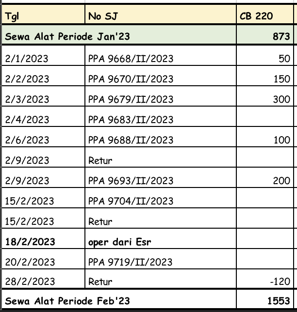
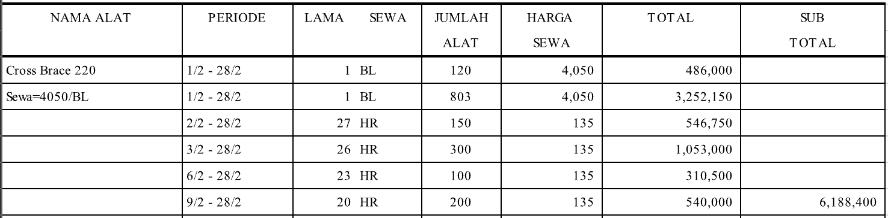
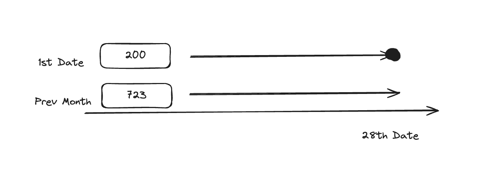
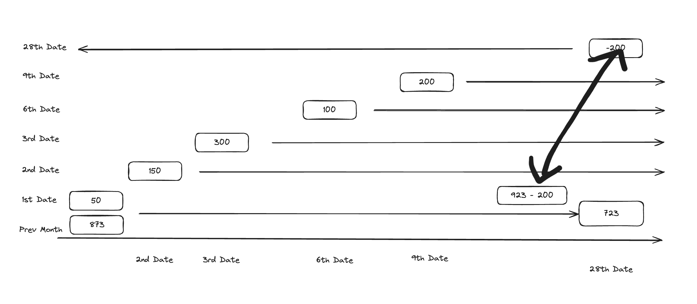

# Bikin Tagihan

Bikin Tagihan rules:

- If it’s a negative that’s higher than the first day of the month: Calculate it via month start until that date

Form now on everything is in daysjs fuck it

Full Bulan calculations:

How do we get from A to B?

Ok. So.

First key thing is to ignore the bottom number.
1553 is completely irrelevant and always will be.

We start at the top then.

From the previous month, a company is
borrowing 873 units.

We think of borrowing these units individually, in the
sense that if I borrow more units, those units
are separate and their own.

So,we start with 873.

The first month comes. On the first day of the month,
we always collate it with the previous month's total.

So 873 + 50 = 923.

We are essentially starting with 923.

We go to the second date. The company borrows 150 more units.

We think of these units as separate from the initial amount, and any following borrowed amounts. They are an independent amount.

Afterwards, on the third day the company borrows 300 more.

On the 6th, and 9th day as well.

So for these amounts,

Say the 6th, it is borrowed from the 6th until the end of the month.

Ok. On the 28th the company decides to return 200 units.

Where do they return the 200 units from? We treat all grouped units as independent right?

We take them from the initial amount always.

So from the 923, we take away 200 units, and are left with 723.

So let's separate the 200 and 723 into two separate parts then.

The 200 units were borrowed until the specified record where it said they stopped borrowin, (the -200 record)

The 723 units however, were left untouched and carried over from the start of the month to the end of the month.

